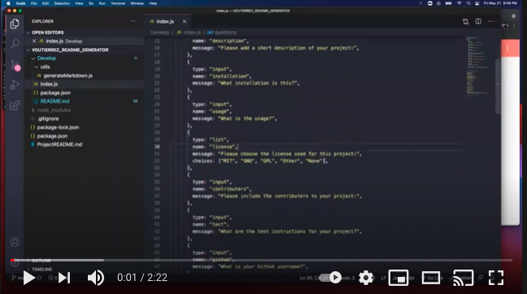
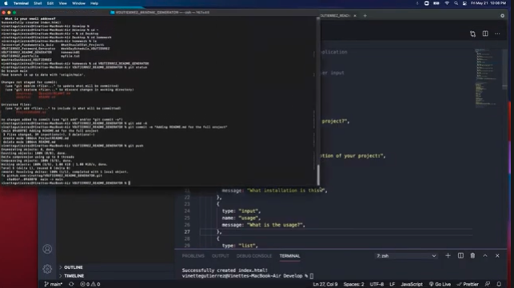

# Vinette's README Generator

Coding Bootcamp homework 9, README generator using node.js

# Table of Contents

- [Summary](#summary)
- [Technologies Used](#technologies-used)
- [How To Use](#how-to-use)
- [Contributers](#contributers)
- [Link to Repo](#trepo)

# Summary

This README generator is a command line application that will help build a basic readme file for any project using node.js. This will allow a creator to spend more time working on their project.

# Technologies Used

[node.js](https://nodejs.org/en/)

# Project Links

  
[![Video demonstration using VS Code Integrated Terminal]](https://youtu.be/LYus5NM7U04)

  
[![Video demonstration using VS Code Integrated Terminal]](https://youtu.be/dV2_mTiKYO4)

# How To Use

1. Navigate to VGUTIERREZ_README_GENERATOR in Terminal.
2. Type "node index.js"
3. Answer questions as prompted.
4. Once questions are complete, README.md will be generated in VS Code.

# Link To Repo

[Repo](https://github.com/vinetteg/VGUTIERREZ_README_GENERATOR)
